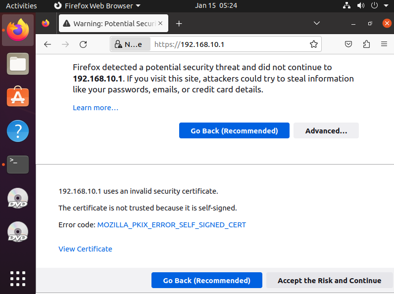
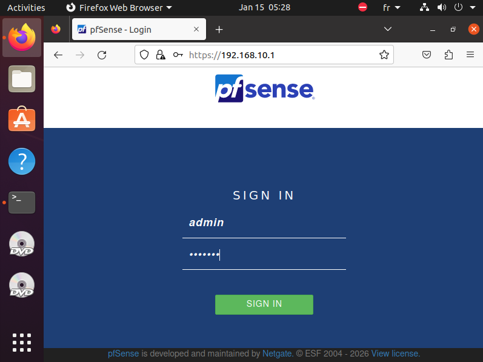
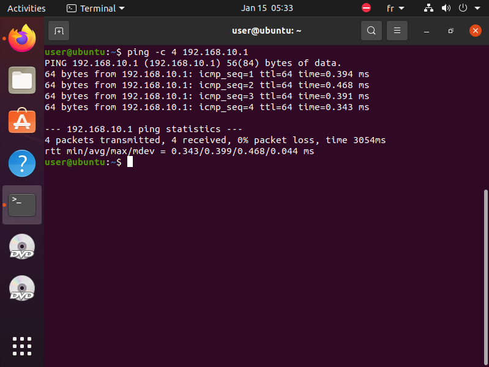
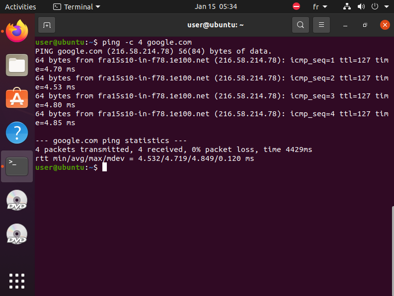
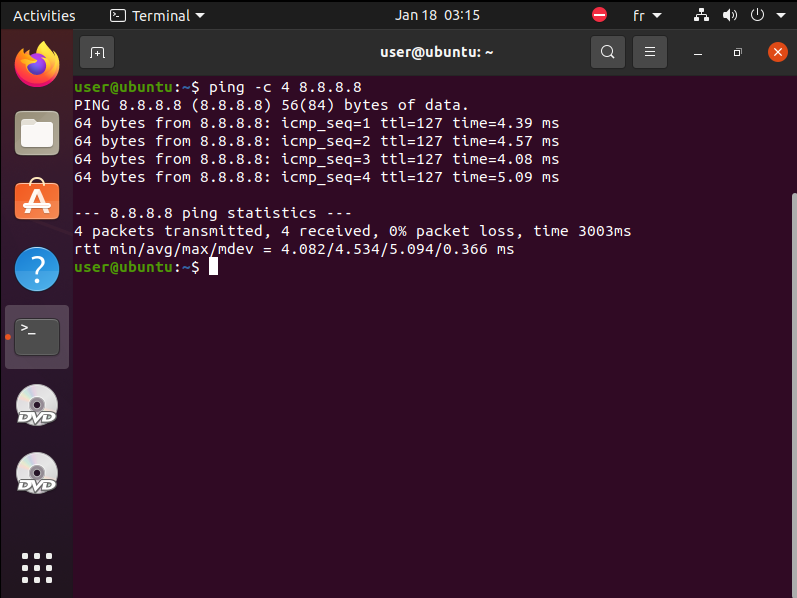
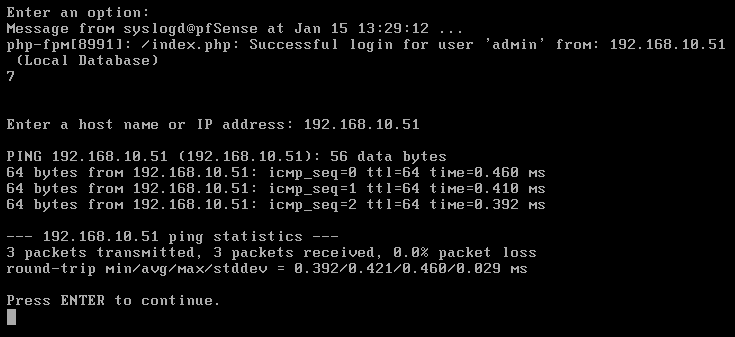
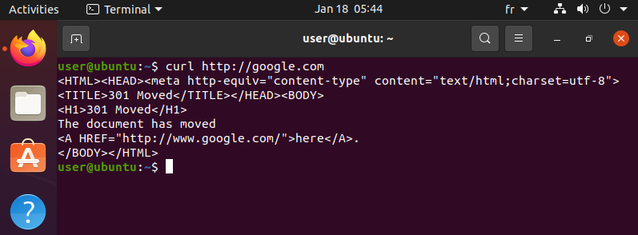
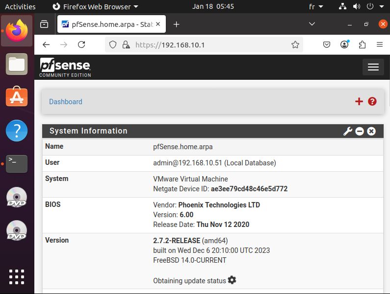
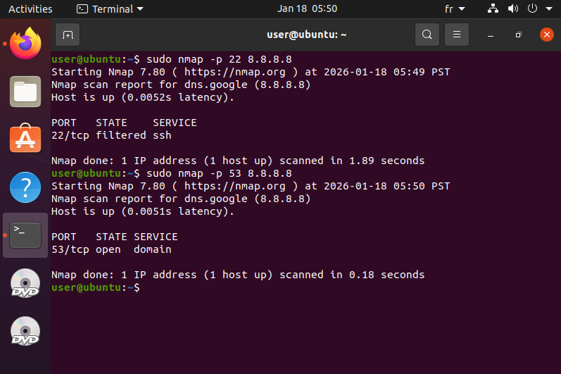
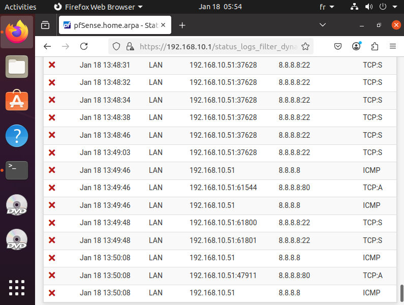

# Validation de l’installation pfSense

## Accès à l’interface d’administration

L’interface Web du pare-feu pfSense est accessible depuis le réseau LAN via HTTPS.  
Un certificat auto-signé est utilisé, ce qui entraîne un avertissement de sécurité côté navigateur, comportement attendu dans un environnement de test.

> Nous utilisons les identifiants par défaut {admin ; pfsense} pour la première connexion, ils seront changés par la suite.

---

## Tests de connectivité réseau

### LAN → Pare-feu
Un test de connectivité ICMP a été effectué depuis un poste client LAN vers la passerelle pfSense.

Résultat : succès.

---

### LAN → Internet (IP)
Un ping vers une adresse publique (8.8.8.8) confirme le bon fonctionnement du routage et du NAT.

Résultat : succès.

---

### LAN → Internet (DNS)
La résolution DNS a été validée via un ping vers un nom de domaine public.

Résultat : succès.

---

### Pare-feu → LAN
Un test ICMP depuis pfSense vers le poste client LAN confirme la connectivité bidirectionnelle contrôlée.

---

## Conclusion

Ces tests valident :
- le bon fonctionnement du DHCP,
- le rôle de passerelle du pare-feu,
- l’accès Internet depuis le LAN,
- la cohérence de la segmentation réseau.  

# Validation du pare-feu et des règles de sécurité

## Tests de connectivité

Plusieurs tests ont été réalisés depuis un poste client du réseau LAN afin de valider l’application des règles de filtrage.

---

### ICMP vers Internet

Un test ICMP vers une adresse publique a été effectué.

Résultat : échec.  
Interprétation : le protocole ICMP n’est pas autorisé, conformément à la politique de filtrage restrictive.

---

### Accès HTTP et HTTPS

Des requêtes HTTP et HTTPS ont été réalisées vers des services externes.

Résultat : succès.  
Interprétation : les flux web autorisés sont fonctionnels.

---

### Accès à l’interface pfSense

L’accès à l’interface d’administration pfSense via HTTPS depuis le LAN est opérationnel.

---

### Accès aux ports non autorisés

Une tentative de connexion vers un port non autorisé (SSH) a été effectuée.

Résultat : échec.  
Interprétation : les ports non explicitement autorisés sont correctement bloqués.

---

## Logs du pare-feu

Les journaux du pare-feu confirment le blocage des flux interdits et permettent une traçabilité des événements de sécurité.

---

## Conclusion

Ces tests valident :
- l’efficacité du filtrage réseau,
- la bonne application du principe du moindre privilège,
- la cohérence entre la politique définie et le comportement observé.

