# Machines Virtuelles Déployées

## 1. Pare-feu

Voir la page [firewall.md](../security/firewall.md) pour plus d'informations.

- **Nom** : pfSense Community Edition  
- **Rôle** : Routage, filtrage, NAT, DHCP  

## 2. Poste Client LAN
- **Système d'exploitation** : Ubuntu Linux  
- **Rôle** : Poste utilisateur interne test  
- **Adresse IP** : Attribuée dynamiquement via DHCP  

Ce poste est utilisé pour valider l’accès au pare-feu et à Internet.

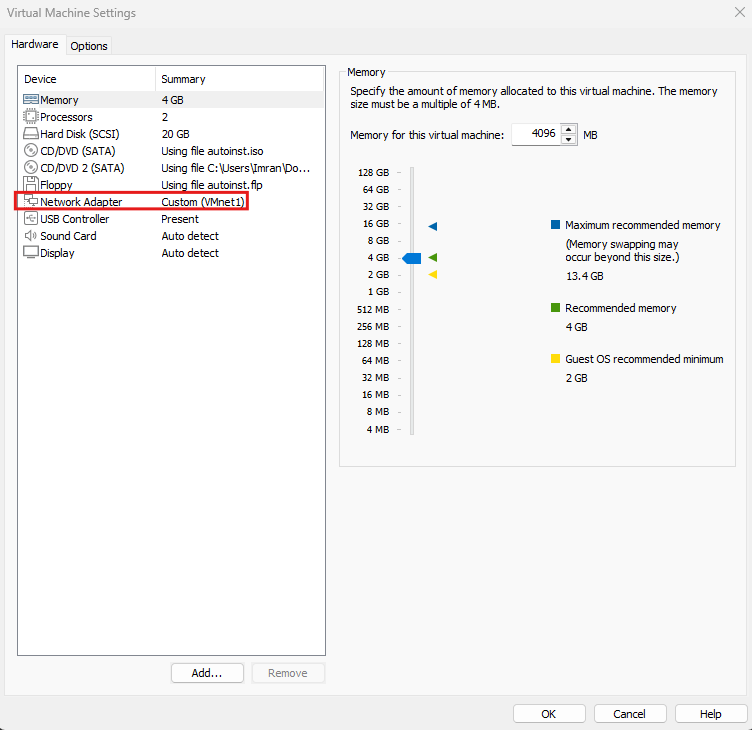

> Nous choisissons le réseau LAN pour le client Ubuntu

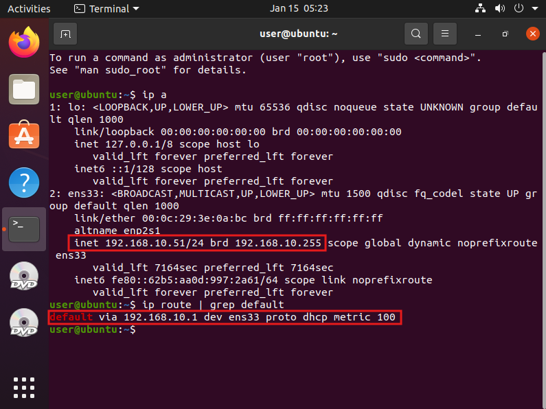

---

## 3. Serveur Active Directory
- **Nom** : Windows Server 2022  
- **Rôle** : Contrôleur de domaine, DNS, Active Directory  
- **Domaine** : `technova.local`  
- **Adresse IP statique LAN** : 192.168.10.10  
- **Mot de passe administrateur** : Robuste (8+ caractères, alphanumérique et spécial)  
- **OU (Unités d'Organisation) créées** : `Users`, `Servers`, `IT`, `RH`, `Sales`  
- **Groupes de sécurité créés** : `GRP-IT`, `GRP-RH`, `GRP-SALES`  
- **Attribution des utilisateurs aux groupes correspondants**  

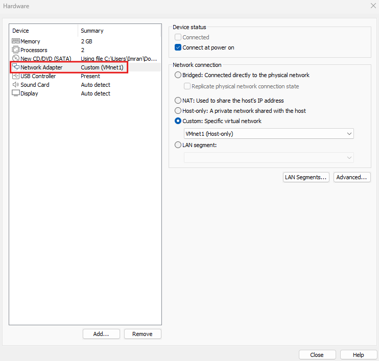
> On place la VM sur le réseau LAN

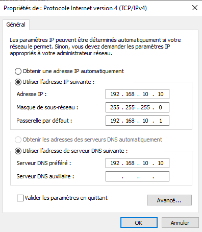
> On attribue manuellement les caractéristiques ipv4 du serveur

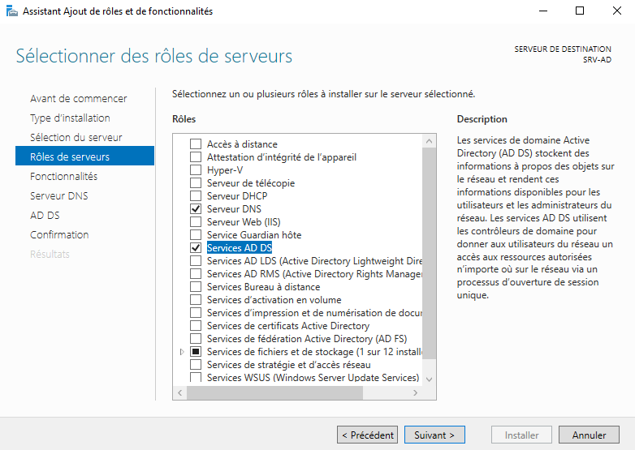

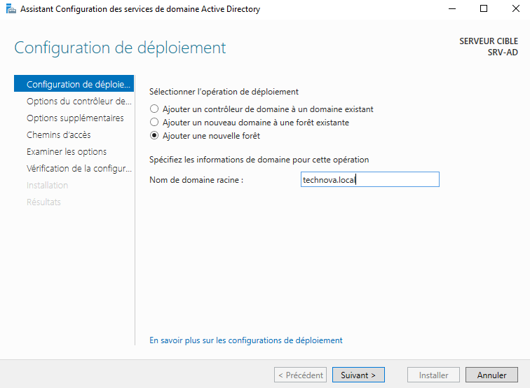

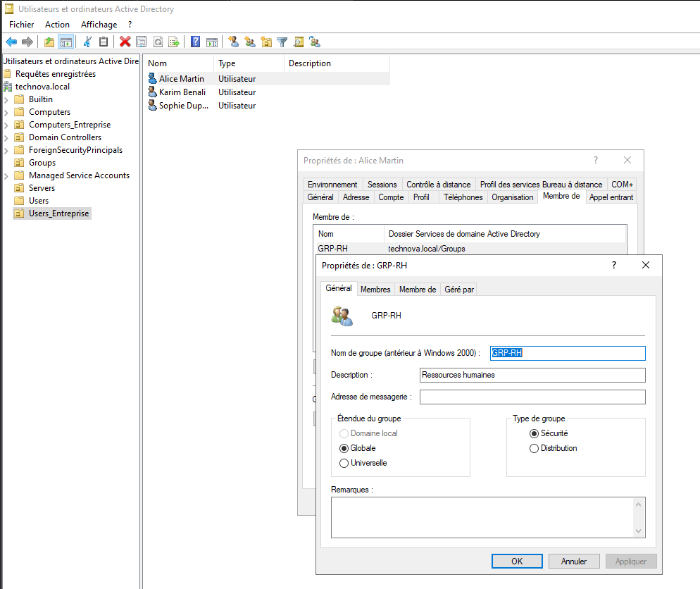
> On crée utilisateurs et groupes pour les futures restrictions comportementales

> On se connecte via le compte administrateur au domaine local

---

## 4. Machine Utilisateur Locale Windows 11
- **Nom** : Windows 11 Professionnal Edition  
- **Rôle** : Poste utilisateur IT de l'entreprise Technova 
- **Adresse IP** : Attribuée dynamiquement via DHCP  

Nous installons tout d'abord la VM sur le sous-réseau LAN :

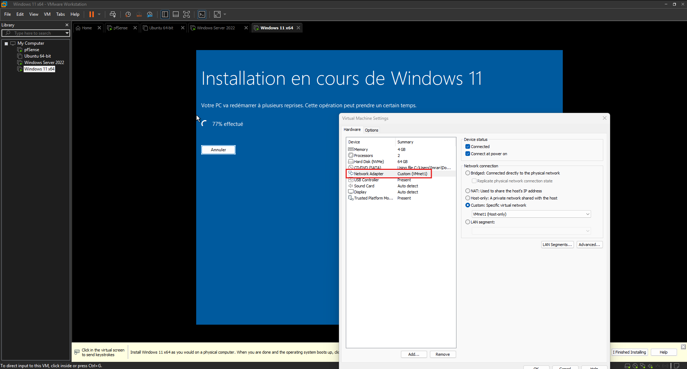

Nous vérifions que la machine reçoit une IP dynamiquement, qu'elle peut ping le serveur AD et que la résolution de noms de domaines fonctionne : 

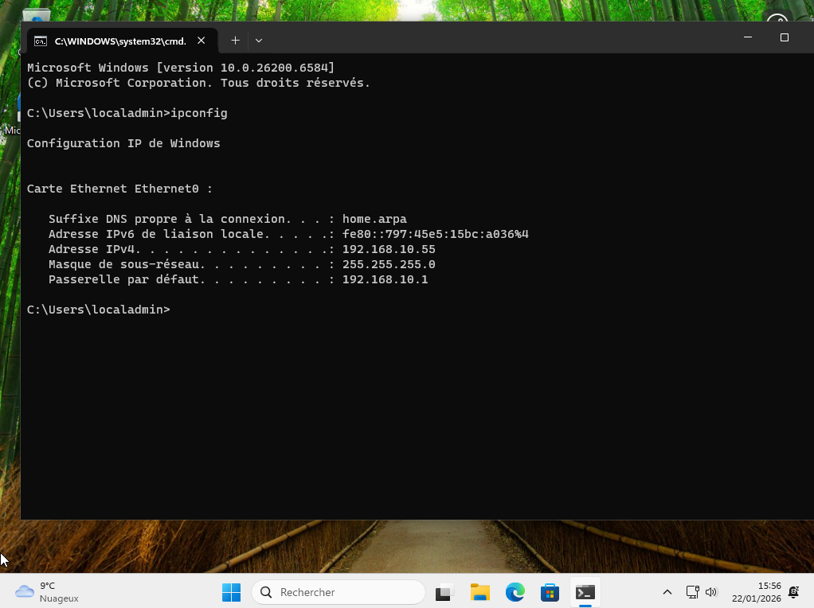

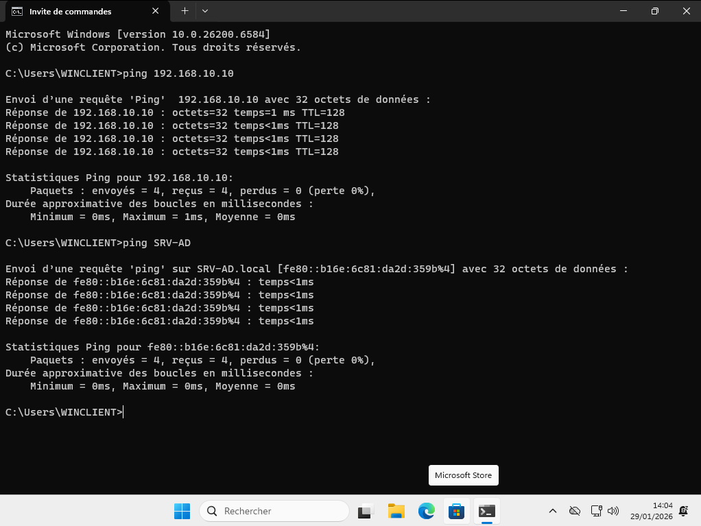

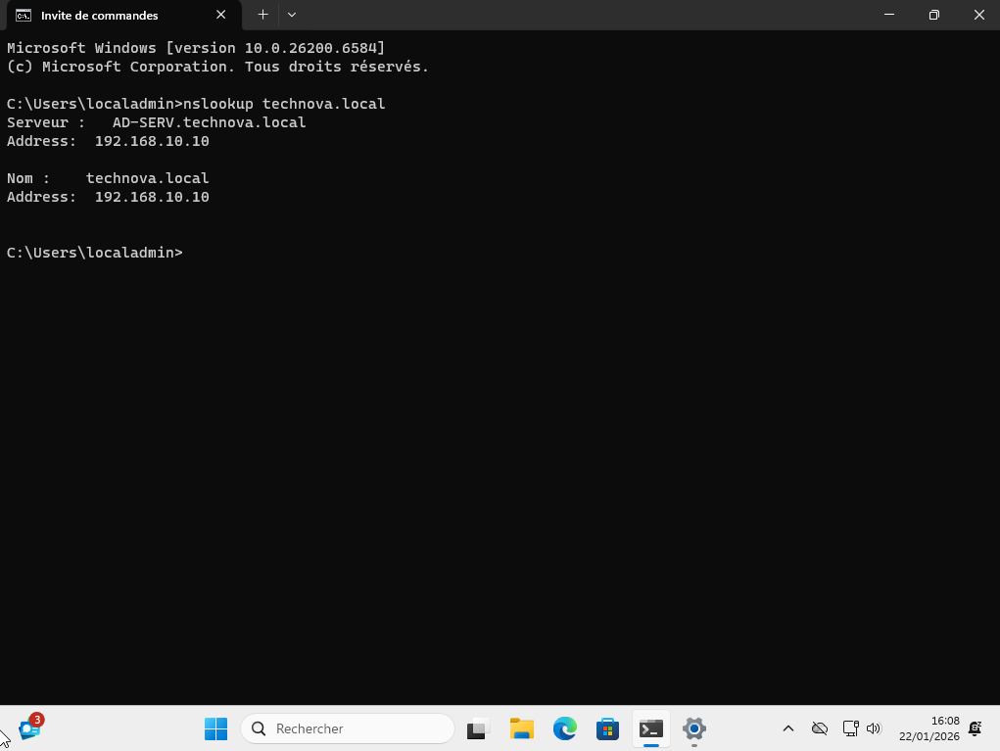

Nous configurons ensuite la machine pour qu'elle fasse partie du domaine Technova défini sur AD : 

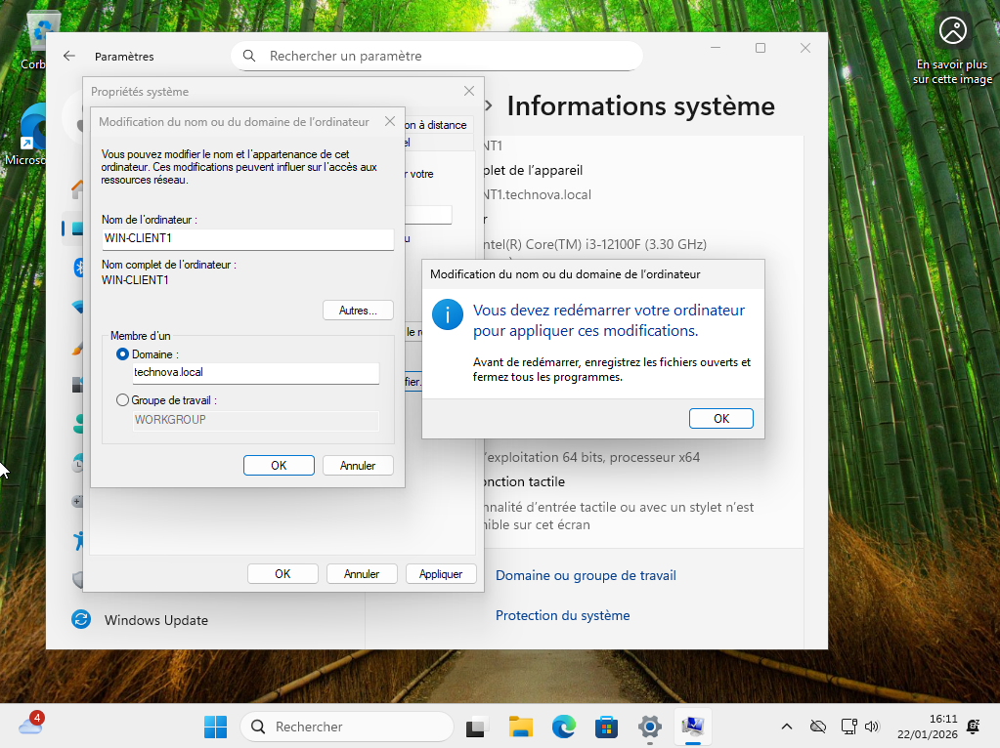

Nous pouvons ensuite nous connecter en tant qu'utilisateur créé au préalable sur AD, en changeant le mot de passe après la première connexion : 

## 5. Machine Utilisateur Locale Windows 11
- **Nom** : Windows 11 Professionnal Edition  
- **Rôle** : Poste utilisateur RH de l'entreprise Technova 
- **Adresse IP** : Attribuée dynamiquement via DHCP  

Après avoir suivi les mêmes étapes d'installation que la VM précdente, nous nous connectons au domaine TECHNOVA via le compte utilisateur appartenant au groupe RH crée sur AD : 

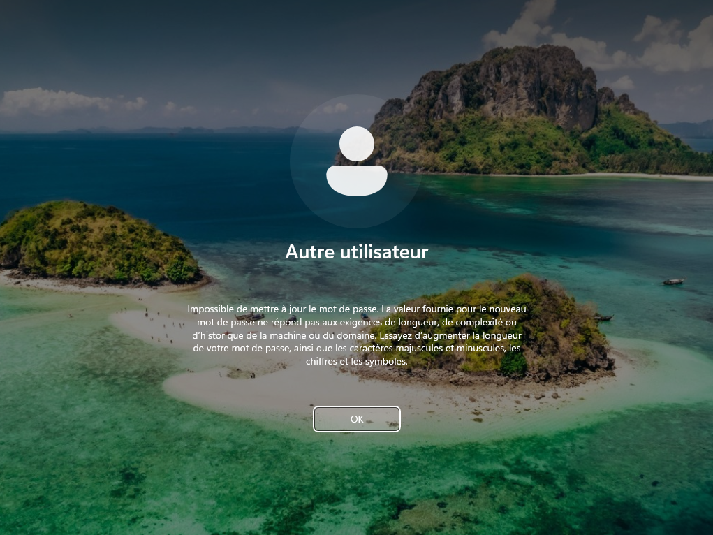
>La GPO mot de passe est appliquée sur les hôtes non administrateurs / SI

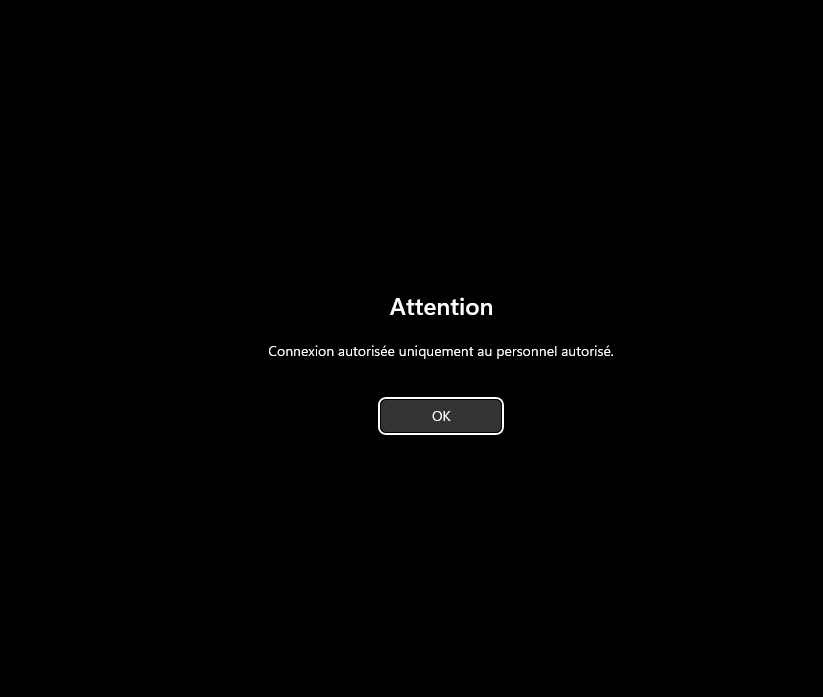
>On se connecte ensuite en créant un mot de passe adéquat puis nous sommes avertis par un message.

