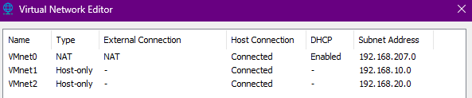
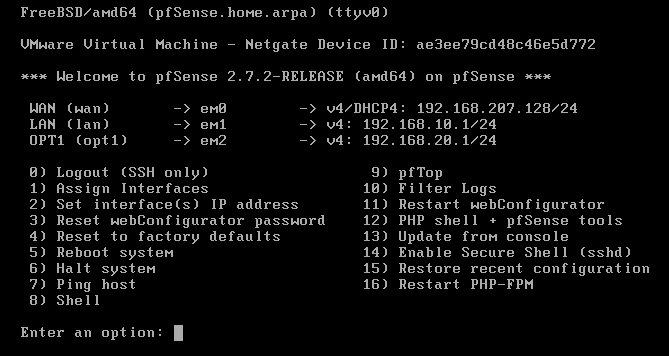

# Configuration réseau

## Environnement virtualisé

L’ensemble de l’infrastructure SecureLab est déployé dans un environnement virtualisé à l’aide de VMware Workstation Pro.  
Chaque zone réseau est isolée à l’aide de réseaux virtuels distincts.

---

## Plan d’adressage IP

| Zone | Réseau | Passerelle |
|---|---|---|
| LAN | 192.168.10.0/24 | 192.168.10.1 |
| DMZ | 192.168.20.0/24 | 192.168.20.1 |
| WAN | DHCP | Fournie par l’hyperviseur |

---

## Pare-feu pfSense

Le pare-feu pfSense dispose de trois interfaces :
- WAN : connectée au réseau externe (DHCP),
- LAN : interface interne avec adresse IPv4 statique,
- DMZ : interface dédiée aux services exposés.

Le pare-feu agit comme passerelle par défaut pour les réseaux LAN et DMZ.

