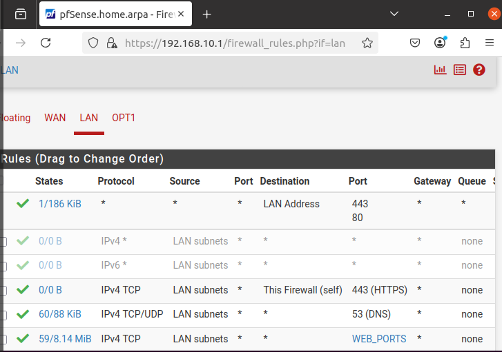
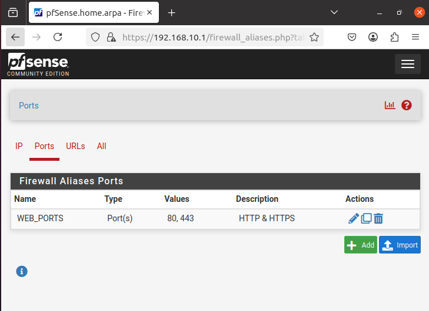
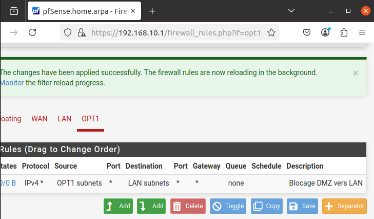

# Politique de filtrage et pare-feu

## Principes de sécurité appliqués

La politique de filtrage du projet SecureLab repose sur le principe du moindre privilège.  
Par défaut, aucun flux n’est autorisé sans règle explicite. Seuls les services strictement nécessaires au fonctionnement de l’infrastructure sont permis.

Le pare-feu pfSense utilisé est de type *stateful*, ce qui signifie que les réponses aux connexions initiées depuis une zone autorisée sont automatiquement acceptées.

---

## Règles appliquées sur le réseau LAN

Les règles suivantes ont été définies pour le réseau interne :

- autorisation de l’accès à l’interface d’administration pfSense en HTTPS,
- autorisation des flux DNS vers l’extérieur,
- autorisation des flux HTTP et HTTPS vers Internet,
- blocage implicite de tout autre trafic.

Afin d’améliorer la lisibilité et la maintenabilité des règles, un alias de ports a été utilisé pour regrouper les ports HTTP (80) et HTTPS (443).

Une règle spécifique, générée automatiquement par pfSense, est présente sur l’interface LAN afin d’éviter toute perte d’accès à l’interface d’administration du pare-feu.

Cette règle autorise les connexions d’administration depuis le réseau LAN vers l’adresse du pare-feu. Elle est conservée volontairement afin de garantir la maintenabilité de l’infrastructure et prévenir tout verrouillage accidentel.

---

## Isolation de la DMZ

Une règle de blocage explicite interdit toute communication initiée depuis la DMZ vers le réseau LAN.  
Cette mesure permet de limiter l’impact d’une éventuelle compromission d’un service exposé et de préserver l’intégrité du réseau interne.

---

## Sécurisation de l’administration

L’accès à l’interface d’administration du pare-feu est restreint au réseau LAN et protégé par le protocole HTTPS.  
Le mot de passe par défaut du compte administrateur a été modifié afin de respecter les bonnes pratiques de sécurité.
