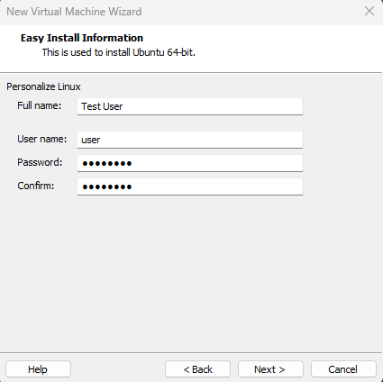
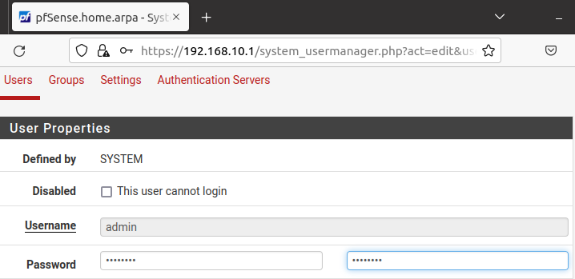
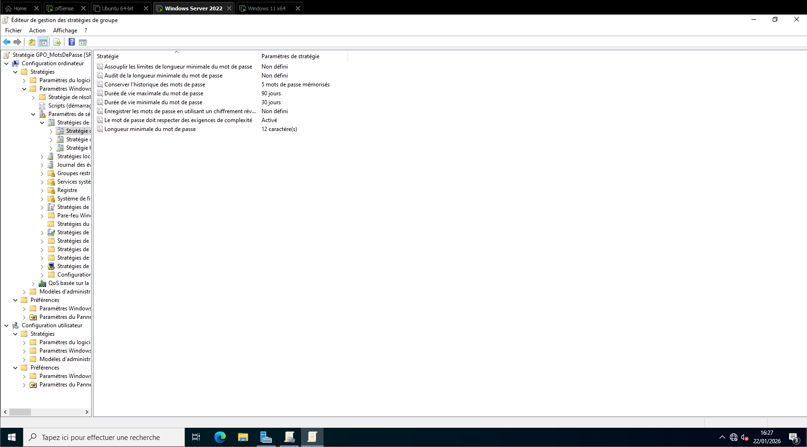
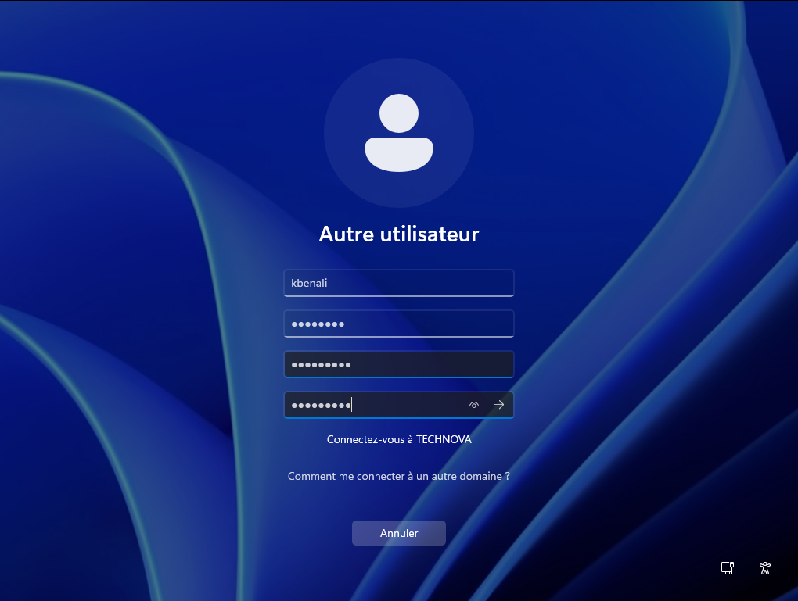
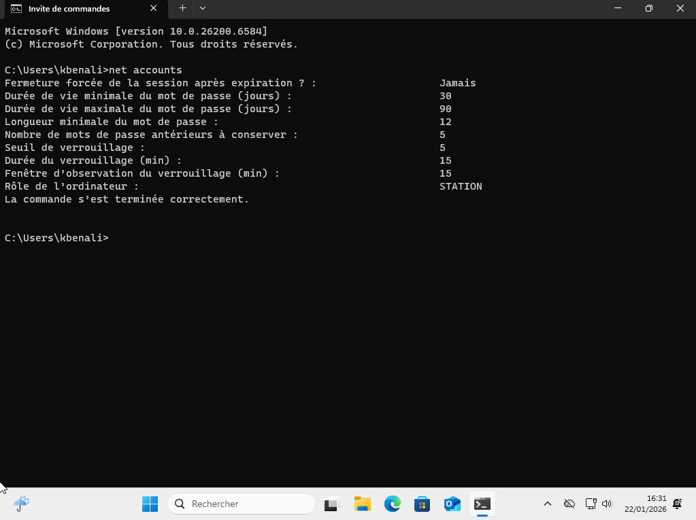
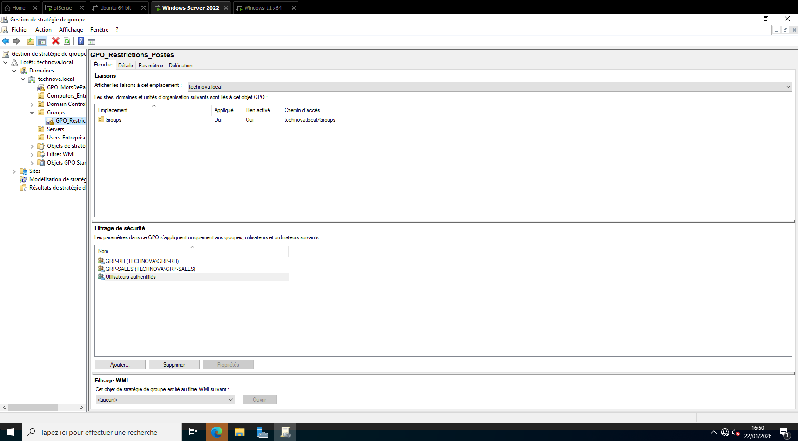
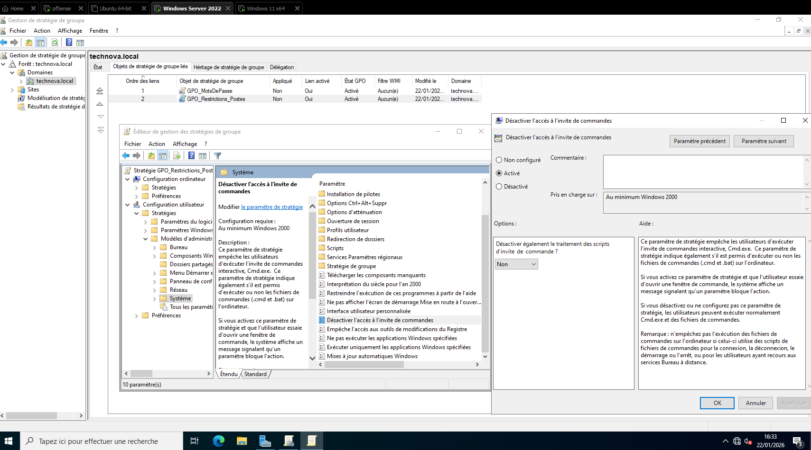
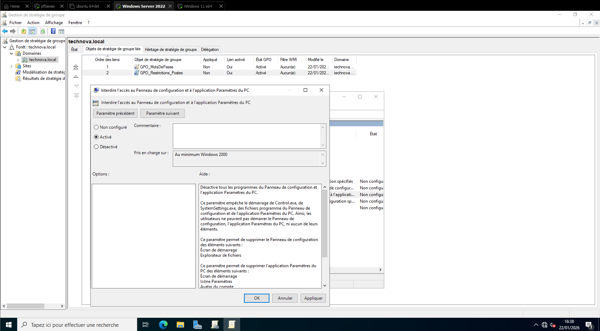
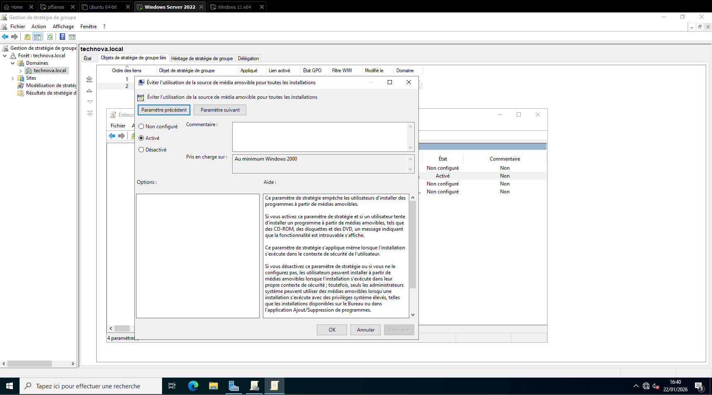
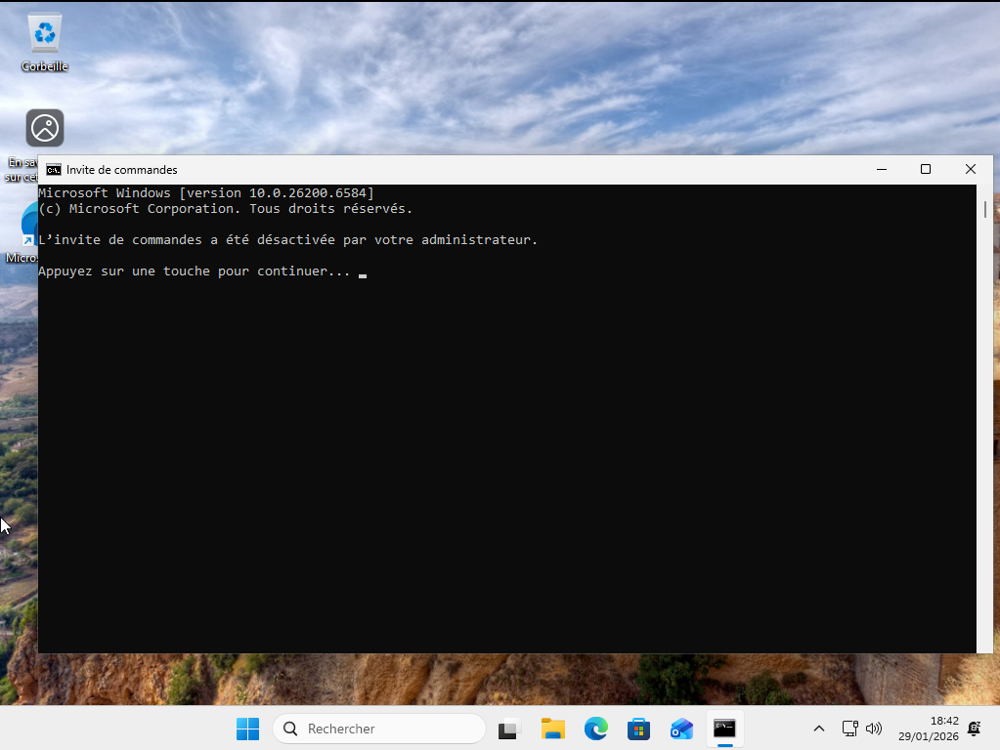

# Principes de durcissement

## Politique de mots de passe

Les systèmes déployés utilisent des mots de passe robustes comprenant :
- au minimum 8 caractères,
- des caractères alphanumériques,
- des caractères spéciaux.

Cette politique permet de réduire les risques liés aux attaques par force brute.

## Sécurisation des accès administrateur

Le compte administrateur du pare-feu pfSense a été sécurisé par la modification du mot de passe par défaut.  
Un mot de passe robuste d’au moins 8 caractères, combinant lettres, chiffres et caractères spéciaux, a été mis en place.

Cette mesure permet de réduire significativement les risques liés aux attaques par force brute ou à l’utilisation d’identifiants connus.

## Politique de mots de passe 

Chaque utilisateur connecté sur un machine rattachée au domaine TECHNOVA doit respecter une politique de mots de passe prédéfinie sur AD à l'aide d'une Group Policy Object (GPO). 

Chaque mot de passe devra respecter les conditions suivantes:
- Être renouvelé à la première connexion
- Contenir au moins 12 caractères
- Respecter des exigences de complexité : un utilisateur ne peut pas utiliser le nom du compte dans son mot de passe ; 3 types de symboles doivent être utilisés dans le mot de passe. Ces symboles sont les suivants : chiffres (0-9), lettres majuscules, lettres minuscules et caractères spéciaux ($, #, %, etc.).
- Doit être utilisé pendant au moins 30 jours avant d'être changé
- Peut être utilisé au maximum 90 jours avant de le modifier
- Doit être différent des 5 derniers mots de passe utilisés

Nous pouvons vérifier la bonne application de cette GPO en nous connectant sur une machine hôte à l'un des comptes utilisateurs définis au préalable. 

Cette mesure permet de réduire significativement les risques liés aux attaques par force brute ou à l’utilisation d’identifiants connus.

## Politique d'accès utilisateur

Selon son appartenance à un groupe de travail, un employé de l'entreprise Technova pourra être restreint dans l'accès de fonctionnalités Windows. 

Les employés ne faisant pas partie du groupe Administrateurs ou GRP-IT (groupe SI de l'entreprise), ne pourront pas accéder aux fonctionnalités suivantes : 
- Accéder à l'invite de commandes
- Accéder à PowerShell
- Accéder au Panneau de Configuration
- Installer de nouveaux programmes sans l'accord d'un Administrateur

Nous pouvons vérifier l'éxécution de cette GPO en tentant d'utiliser le cmd en se connectant en tant qu'utilisateur RH :

